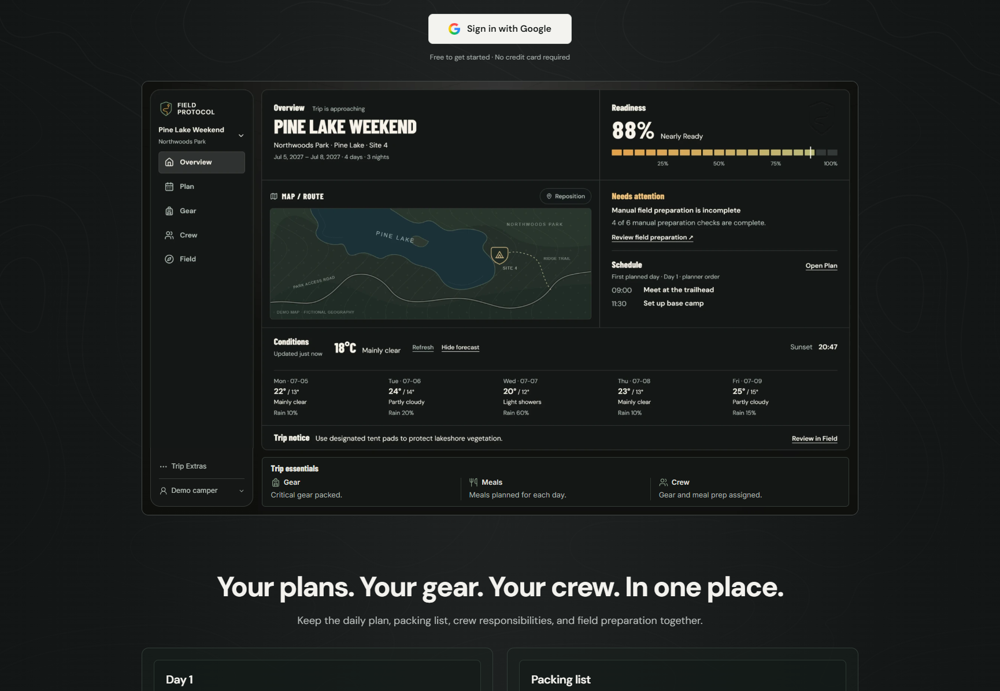

# Signed-out landing page checkpoint — 2026-10-02

Checkpoint tag: `checkpoint/signed-out-landing-2026-10-02`.

This checkpoint completes the desktop signed-out landing page around the approved hero. It includes the related JetBrains Mono font-loading fix encountered during development.

## Included changes

- Desktop header navigation, product feature examples, readiness explanation, setup steps, FAQ, closing sign-in section, and footer.
- Shared Google sign-in pending state, duplicate-request protection, and one error message at the active sign-in location.
- Complete workspace preview with Trip essentials, an aligned sidebar footer, and bottom spacing matched to the top inset. Preview scale is preserved as the frame adapts to desktop widths. The later local consolidation uses one 2560 × 1551 image including Invite, essentials, and the footer; see [the maintained capture workflow](desktop-workspace-preview.md). The outer instrumentation remains live.
- Scoped desktop styles and regression coverage for composition, navigation, static examples, sign-in behavior, and phone isolation.
- Locally bundled JetBrains Mono 2.211 with its SIL Open Font License and source provenance. Existing weights, font variable, display mode, and fallbacks are retained to resolve the Turbopack Google-font URL parsing error.

The phone composition and its device-classification logic are unchanged by this package. Separate working-tree edits for mobile readiness and infrastructure are excluded.

## Validation

Fresh checkpoint checks:

- 48 tests passed across `SignedOutLanding.test.tsx`, `PhoneLayoutProvider.test.tsx`, and `typographyFoundation.test.ts`.
- Targeted ESLint passed for the two desktop components, landing tests, root layout, and typography tests.
- Source TypeScript check passed. This check covers `src/**/*.ts`, `src/**/*.tsx`, and `next-env.d.ts`, without generated Next route guards or archived output directories.

Browser verification from the completed implementation:

- Eleven desktop/phone cases passed device classification, overflow, image loading, and runtime-error checks.
- Six desktop geometry checks preserve image scale and exact sidebar/essentials bottom alignment. Bottom inset matches 1.125% of preview width within 0.015px.
- At 1730px viewport width, bottom inset is 13.921875px against a 13.9275px top inset. The 768px desktop row has a 0.203125px positioning-rounding difference from its previous position, with no clipped content.
- Six phone DOM captures, six phone viewport screenshots, and eight phone scroll screenshots match their before captures exactly.

Known validation boundary: the earlier full production build encountered the pre-existing extra `TripsContent` export in `src/app/trips/page.tsx`. This checkpoint does not claim a passing production build or include a change to that route.

## Visual reference

The saved desktop view shows the final workspace frame and its transition into the feature section.

